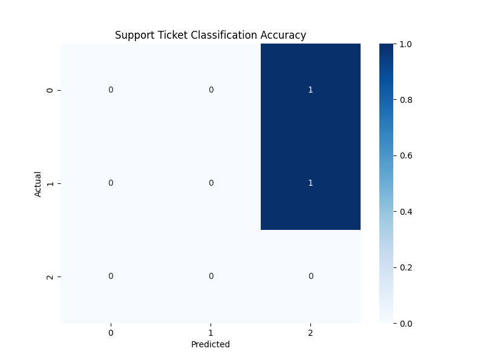

# FUTURE_ML_02
Machine Learning Task 2  Support Ticket Classification &amp; Prioritization

# Future Interns ML Internship - Task 02

### 📋 Project: Support Ticket Classification & Prioritization
Intern Name: Mohammed Najeeb  
CIN ID: FIT/JAN26/ML4668  
Track: Machine Learning (ML)  

 # Project Overview
This project uses Natural Language Processing (NLP) to automate the sorting of customer support tickets. By analyzing the text content, the system classifies tickets into categories (Technical, Billing, Account) and assigns a priority level.

## 🛠️ Implementation Steps
1. **Text Preprocessing:** Used RegEx for cleaning and converted text to lowercase.
2. **Feature Extraction:** Implemented **TF-IDF Vectorization** to convert words into numerical data.
3. **Classification:** Trained a **Random Forest Classifier** to identify ticket types.
4. **Evaluation:** Generated a confusion matrix to visualize model performance.

## 📊 Business Impact
- **Efficiency:** Reduces manual sorting time for support agents.
- **Speed:** Ensures "High Priority" tickets (like server crashes) are seen first.
- **Accuracy:** Minimizes human error in ticket routing.

## 📂 Deliverables
- `Task2_Ticket_Classification.py`: NLP and Classification logic.
- `classification_matrix.png`: Visual evaluation of the model.

  
  
